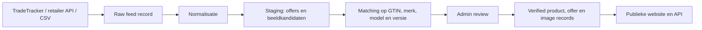

# BACKEND-FEED-ROADMAP.md

## Doel

Loopwijzer moet klaarstaan om later betrouwbaar productdata, retailerprijzen, productbeelden en affiliate-links uit feeds of API's te verwerken.

De kernregel blijft: feeddata wordt nooit rechtstreeks publiek getoond. Alles komt eerst in staging, wordt gematcht, gecontroleerd en pas daarna gepubliceerd.

## Architectuur

## Bouwblokken Die Nu Klaarstaan

- Product-, offer- en beeldstatussen in `src/types/product.ts`.
- Feed staging types in `src/types/feed.ts`.
- Eerste normalisatielaag in `src/lib/feed-normalization.ts`.
- Publieke health endpoint: `/api/health`.
- Publieke catalog endpoint: `/api/catalog/shoes`.
- Public UI toont alleen verified offers via `getPublicOffersForShoe`.

## Feed Importregels

1. Sla ruwe feedrecords eerst op als `RawFeedRecord`.
2. Normaliseer prijzen, beschikbaarheid, retailernaam, URL en afbeeldingskandidaten.
3. Match eerst op GTIN/EAN wanneer beschikbaar.
4. Match daarna voorzichtig op merk, model en versie.
5. Geef elke match een confidence: `none`, `low`, `medium`, `high` of `exact`.
6. Publiceer alleen records met betrouwbare match en geldige bronstatus.
7. Toon geen placeholder-URL's, ontbrekende prijzen of onbevestigde beelden publiek.

## Minimale Back-End Entiteiten

Wanneer we overstappen van JSON naar database, zijn dit de eerste tabellen:

- `brands`
- `shoes`
- `shoe_editorial_scores`
- `retailers`
- `offers`
- `feed_imports`
- `feed_records`
- `image_candidates`
- `admin_reviews`

## API-Richting

Eerste interne API's:

- `GET /api/health`: status en datatellingen.
- `GET /api/catalog/shoes`: publieke catalogus zonder ruwe feeddata.
- Later: `POST /api/admin/imports/tradetracker`: feedimport starten.
- Later: `GET /api/admin/imports/:id`: importstatus en warnings.
- Later: `POST /api/admin/offers/:id/publish`: gecontroleerde offer publiceren.

Admin write-endpoints blijven achter authenticatie. Publieke endpoints geven nooit ruwe feedpayloads of adminstatussen terug.

## TradeTracker Integratie

Voor TradeTracker is de gewenste volgorde:

1. Publisher approval afronden met een geloofwaardige publieke site.
2. Toegang tot campagne/feed aanvragen.
3. Feedvelden mappen naar `RawFeedRecord`.
4. Normalisatie draaien.
5. Matchrapport in admin tonen.
6. Beelden en offers pas na review publiek zetten.

## Waarom Dit Belangrijk Is

Deze aanpak beschermt het vertrouwen van Loopwijzer:

- Geen fake prijzen.
- Geen verkeerde productfoto's.
- Geen directe afhankelijkheid van rommelige feedtitels.
- Geen commerciële data die redactionele score overschrijft.
- Wel een schaalbare route naar echte prijsvergelijking.
